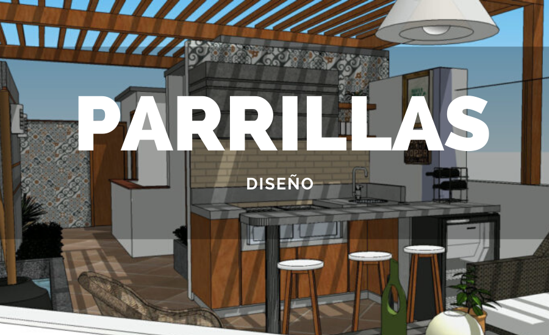

# SOLOQUINCHO

# Descripción del sitio
Bienvenido a nuestro e-commerce - Venta de accesorios para Quincho
La primera plataforma que nuclea todos los productos regionales necesarios para disfrutar un tiempo de encuentro en el quincho, familiares, empresariales y/o asociaciones, clubes. 

# PRODUCTOS
1- Madera: platos, tablas para carne, bandejas, cuchilleras.
2- Hierro: espadines, discos de arado, ollas, parrillas, quemadores, fogones.
3- Utensilios de cocina:
-----------------------------------------------------------------------------
# ADORNOS
Artefactos de iluminación, blanquería artesanal.
CRISTALERÍA: Vasos, copas, jarras.
e-comerce enfocado a la venta de accesorios para quinchos, donde los usuarios podrán realizar pedidos, agregarlos al carrito de compras y pagar a través de Mercadopago.

# Paleta de colores
https://coolors.co/96bbbb-618985-414535-f2e3bc-c19875

En breve estaremos agregando más contenido al sitio.
Muchas gracias!

# Link de Figma
[Link Diseño Figma "SoloQuincho"](https://www.figma.com/file/kUZNGqNlKHxvI3xaJBf5ST/Dise%C3%B1o-e-commerce-OscarMarmeli?type%3Ddesign%26node-id%3D0-1%26t%3D1KHIjD4YdHNJeAPo-0)

# Adjunto página de inicio "Index.html" (en desarrollo).
# Adjunto Carpeta de Imágenes y Carpeta de Figma con los diseños en PNG.